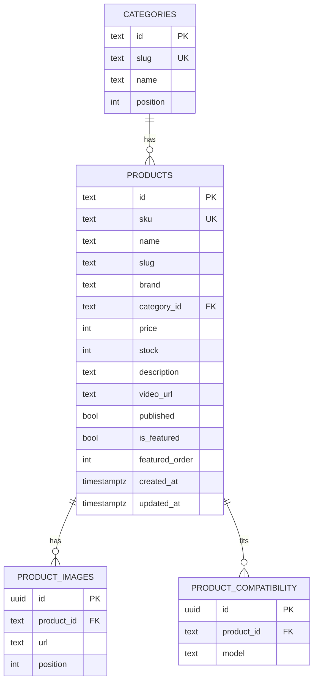

# Product CMS with Neon — Design Spec

**Date:** 2026-08-06
**Status:** Draft for review
**Branch:** `feat/catalog-only-admin-split`

## 1. Goal

Turn the admin dashboard into a real CMS for **products**, backed by a shared
database so edits made in the dashboard appear on the public storefront. Today
all data is client-side mock (`src/data/*.js` → localStorage), and the
storefront and admin are separate deployments with separate localStorage — so
nothing an admin edits can reach the public site. This adds a real data layer.

Products first, but the schema and code seams are designed so the same pattern
extends to full landing-page content later (phase 2) without rework.

## 2. Scope

**In scope (phase 1):**
- Products and categories move to Neon Postgres as the single source of truth.
- Storefront reads products/categories from a public read-only API.
- Admin dashboard performs product CRUD through a protected write API.

**Out of scope (phase 1):**
- Image **upload**. Products store image URLs (admin pastes/picks a URL).
  File upload needs Vercel Blob — deferred to phase 1.5/2.
- Landing-page copy (hero, promo bar, FAQ, "how it works") — phase 2.
- Orders, chats, users, shipping, promos — stay mock/localStorage for now.
- Reviews/ratings — already removed from the storefront and omitted from the schema.

**Phase 2 (future, additive):** `site_settings` (key–value copy), `homepage_banners`,
`faqs`, `how_it_works_steps`. Same pattern: table → endpoint → consumed by storefront.

## 3. Architecture

- **Neon Postgres** — one database, single source of truth, shared by both deployments.
- **Vercel Functions** (`api/` directory) provide a thin API. `api/` works in a Vite
  project deployed to Vercel with no framework change.
  - **Storefront deployment:** read-only endpoints. Uses a **read-only Neon role**.
  - **Admin deployment:** read + write endpoints, behind Vercel Deployment Protection.
    Uses a **read-write Neon role**.
- DB access via `@neondatabase/serverless` (HTTP driver, suits Fluid Compute).

```
Admin dashboard ──POST/PUT/DELETE /api/admin/products──▶ Function (rw role) ─▶ Neon
Storefront      ──GET /api/products, /api/categories───▶ Function (ro role) ─▶ Neon
```

## 4. Data model (ERD)



Notes:
- `images`, `compatibleWith` (arrays in the current mock) become child tables so
  each item is editable individually.
- `is_featured` + `featured_order` replace the redundant `homepage.featuredProductIds`.
- No `rating` / `review_count` / reviews (removed).

### Schema (Postgres DDL)

```sql
create table categories (
  id       text primary key,
  slug     text unique not null,
  name     text not null,
  position int  not null default 0
);

create table products (
  id             text primary key,
  sku            text unique not null,
  name           text not null,
  slug           text not null,
  brand          text,
  category_id    text references categories(id),
  price          int  not null,
  stock          int  not null default 0,
  description    text,
  video_url      text,
  published      boolean not null default true,
  is_featured    boolean not null default false,
  featured_order int,
  created_at     timestamptz not null default now(),
  updated_at     timestamptz not null default now()
);
create index on products (category_id);
create index on products (published);

create table product_images (
  id         uuid primary key default gen_random_uuid(),
  product_id text not null references products(id) on delete cascade,
  url        text not null,
  position   int  not null default 0
);
create index on product_images (product_id);

create table product_compatibility (
  id         uuid primary key default gen_random_uuid(),
  product_id text not null references products(id) on delete cascade,
  model      text not null
);
create index on product_compatibility (product_id);
```

## 5. API

Responses assemble child rows so a product matches the shape the UI already
uses (`images: string[]`, `compatibleWith: string[]`) — keeping the hook
interface stable.

**Public (storefront deployment), read-only:**
- `GET /api/products` — published products; optional `?category=&q=&featured=`
- `GET /api/products/[id]` — one product (with images + compatibility)
- `GET /api/categories` — categories ordered by `position`

**Admin (admin deployment), protected:**
- `GET /api/admin/products` — all products incl. unpublished
- `POST /api/admin/products` — create
- `PUT /api/admin/products/[id]` — update (incl. images/compatibility)
- `DELETE /api/admin/products/[id]` — delete
- (Category CRUD optional in phase 1; categories can be seeded and edited later.)

Write endpoints validate input and return the saved object.

## 6. Code changes (the seam)

The abstraction boundary is the store hooks, so consumer components barely change.

- **New:** `api/` Vercel Functions; `src/lib/api.js` (public fetch helpers);
  `src/lib/adminApi.js` (write helpers); DB migration + seed under `db/`.
- **Modified hooks** (`src/store/hooks.js`): `useProducts`, `useProduct`,
  `useCategories` fetch from the API with `loading` / `error` state, keeping the
  same return shape. Products/categories are no longer seeded into `StoreProvider`.
- **Storefront:** add loading / empty / error states in `HomePage`, `SearchPage`,
  `ProductDetailPage` (currently assume data is synchronously present).
- **Admin:** `ProductsPage` / `ProductFormPage` call `adminApi` instead of local
  store mutations; drop the now-defunct rating/testimonial fields from the form.
- **StoreProvider:** keeps orders, users, chats, promos, shipping, homepage
  (still mock) — only products/categories are extracted.

## 7. Migration & seed

- `db/migrations/001_init.sql` — the DDL above.
- `db/seed.mjs` — reads `src/data/products.js` + `src/data/categories.js` and
  inserts into Neon (idempotent / upsert). Run once after provisioning.

## 8. Security

- `DATABASE_URL` lives only in Function env (server-side), never `VITE_`-prefixed,
  never in a browser bundle.
- Storefront uses a **read-only** Neon role; admin uses **read-write**. A bug in a
  storefront function cannot write.
- Write endpoints exist only on the admin deployment (behind Deployment Protection)
  and additionally require an `ADMIN_API_SECRET` header (defense in depth).
- Input validation on all writes.

## 9. Provisioning (implementation-time, needs user's Vercel account)

1. Install Vercel CLI; `vercel link` each project.
2. Add Neon via Marketplace: `vercel integration add neon` (or dashboard) — sets `DATABASE_URL`.
3. Create read-only + read-write roles; set each project's `DATABASE_URL` accordingly.
4. `vercel env pull`; run migration + seed.
5. Set `ADMIN_API_SECRET` on the admin project.

## 10. Testing

- **Unit:** API handlers with a mocked DB (list/get/create/update/delete, validation, auth-header check).
- **Integration:** hooks render loading → data → empty/error paths.
- **Manual (browser):** create/edit a product in admin → confirm it appears/updates on the storefront.
- Runner: existing `node --test`.

## 11. Risks / open questions

- Both deployments must have DB env set; storefront's role must be read-only.
- Storefront is no longer fully static — function cold starts (mitigated by Fluid Compute).
- Image upload (Vercel Blob) intentionally deferred; confirm URL-only products are acceptable for phase 1.
- Confirm keeping product IDs as `text` (`p1`, `p2` …) from the current seed vs. switching to UUIDs.

## 12. Reconciliation — what actually shipped (updated 2026-08-07)

The core design (Neon source of truth, Vercel Functions read/write API, normalized
schema, hook seam, security gating) shipped as designed. Intentional changes made
during implementation, driven by evolving requirements:

- **`stock` removed** — the catalog has no transactions, so the `stock` column and all
  its UI (storefront badge, admin form field, low-stock metrics/notifications, CSV
  import column) were dropped. The schema, data-access, and seed no longer reference it.
- **Reviews/rating removed** earlier and never added to the schema (as this spec already reflected).
- **Admin data layer = "API-backed store" (Option B).** The admin screens were more
  deeply coupled to the local store than section 6 assumed (Dashboard metrics, search),
  so instead of rewiring each screen, `StoreProvider` itself fetches products/categories
  from the admin API on mount and routes its mutators through the API — gated to the
  admin build via `import.meta.env.VITE_APP_TARGET === 'admin'`.
- **Dev bridge** (`dev/api-bridge.js`) added so `/api/*` runs under `vite` dev locally
  against Neon — replaces the plan's assumed `vercel dev` (Vercel CLI unavailable; the
  Vercel account belongs to a third party).
- **Admin slimmed to Dashboard + Produk.** All order/sales/revenue/customer/chat/settings/
  integration/help UI and routes were removed to match reality (catalog-only). Dashboard
  now shows product-focused stats (Total Produk, Produk Unggulan, Total Kategori) + a
  recent-products list.
- **Provisioning** done via a Neon account owned by the business (direct connection
  string) rather than `vercel integration add neon`, decoupling the database from the
  third-party Vercel account.

Still open (deploy-time): storefront should use a **read-only Neon role** (both currently
use one owner role locally). See `docs/deployment.md`.
